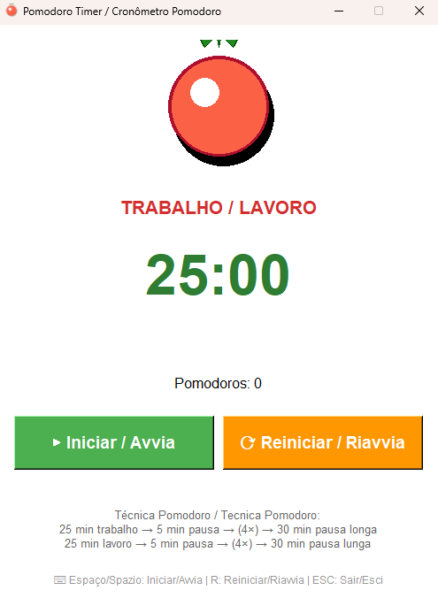

# 🍅 Pomodoro Timer / Cronômetro Pomodoro

🇧🇷 **Português** | 🇮🇹 **Italiano**

Aplicativo de gerenciamento de tempo baseado na Técnica Pomodoro.  
Applicazione per la gestione del tempo basata sulla Tecnica Pomodoro.



---

## 📖 Descrição / Descrizione

### 🇧🇷 Português

O Pomodoro Timer é uma ferramenta para aumentar a produtividade através da Técnica Pomodoro. O método consiste em trabalhar por 25 minutos (um "pomodoro"), seguido de 5 minutos de descanso. Após completar 4 pomodoros, o usuário ganha um descanso maior de 30 minutos. O aplicativo possui interface gráfica intuitiva com animação de tomate e sistema de notificações sonoras.

### 🇮🇹 Italiano

Il Pomodoro Timer è uno strumento per aumentare la produttività attraverso la Tecnica Pomodoro. Il metodo consiste nel lavorare per 25 minuti (un "pomodoro"), seguito da 5 minuti di pausa. Dopo aver completato 4 pomodori, l'utente ottiene una pausa più lunga di 30 minuti. L'applicazione ha un'interfaccia grafica intuitiva con animazione di pomodoro e sistema di notifiche sonore.

---

## ✨ Funcionalidades / Funzionalità

### 🇧🇷 Português

- Ciclos de trabalho de 25 minutos (Pomodoro)
- Pausas curtas de 5 minutos
- Pausa longa de 30 minutos após 4 pomodoros
- Interface gráfica com animação de tomate
- Notificações sonoras ao final de cada ciclo
- Contador visual de pomodoros completados
- Histórico de sessões em arquivo de log
- Ícone personalizado do tomate
- Compilação para executável Windows

### 🇮🇹 Italiano

- Cicli di lavoro di 25 minuti (Pomodoro)
- Pause brevi di 5 minuti
- Pausa lunga di 30 minuti dopo 4 pomodori
- Interfaccia grafica con animazione di pomodoro
- Notifiche sonore alla fine di ogni ciclo
- Contatore visivo dei pomodori completati
- Cronologia delle sessioni in file di log
- Icona personalizzata del pomodoro
- Compilazione in eseguibile Windows

---

## 📸 Interface / Interfaccia

### Tela Inicial / Schermata Iniziale

A interface apresenta timer em destaque, contador de pomodoros e botões de controle bilíngues.  
L'interfaccia presenta il timer in evidenza, il contatore dei pomodori e i pulsanti di controllo bilingue.

---

## Requisitos do Sistema / Requisiti di Sistema

- Windows 7/8/10/11 (ou Linux/macOS com Python)
- Python 3.7 ou superior / Python 3.7 o superiore
- Resolução mínima / Risoluzione minima: 800x600 pixels

---

## Dependências / Dipendenze

- Python 3.x (tkinter incluído / tkinter incluso)
- Pillow >= 10.0.0 (manipulação de imagens / manipolazione di immagini)
- playsound >= 1.3.0 (notificações sonoras / notifiche sonore)
- PyInstaller >= 6.0.0 (compilação para executável / compilazione in eseguibile)

---

## Instalação e Execução / Installazione ed Esecuzione

### Método 1: Executar com Python / Metodo 1: Eseguire con Python

**Português:**
1. Clone ou baixe este repositório
2. Instale as dependências:
```bash
pip install -r requirements.txt
```
3. Execute o aplicativo:
```bash
python pomodoro.py
```

**Italiano:**
1. Clona o scarica questo repository
2. Installa le dipendenze:
```bash
pip install -r requirements.txt
```
3. Esegui l'applicazione:
```bash
python pomodoro.py
```

### Método 2: Arquivo Batch (Windows) / Metodo 2: File Batch (Windows)

Execute o arquivo / Esegui il file `executar_pomodoro.bat` com duplo clique / con doppio clic.

---

## Compilação para Executável / Compilazione in Eseguibile

### Compilação Automática / Compilazione Automatica

**Português:**  
Execute o script de compilação:
```bash
python pomodoro_exe.py
```

Ou use o arquivo batch:
```bash
compilar_pomodoro.bat
```

**Italiano:**  
Esegui lo script di compilazione:
```bash
python pomodoro_exe.py
```

O usa il file batch:
```bash
compilar_pomodoro.bat
```

### Compilação Manual / Compilazione Manuale

1. Instale PyInstaller / Installa PyInstaller:
```bash
pip install pyinstaller
```

2. Compile o executável / Compila l'eseguibile:
```bash
pyinstaller --onefile --windowed --name pomodoro --icon pomodoro.ico pomodoro.py
```

3. O executável será criado em / L'eseguibile sarà creato in `dist/pomodoro.exe`

---

## Configuração e Uso / Configurazione e Uso

### Interface Principal / Interfaccia Principale

**Português:**
- **Contador de Tempo**: Exibe o tempo restante no ciclo atual (25min trabalho, 5min pausa curta, 30min pausa longa)
- **Botão Iniciar/Pausar**: Controla o timer
- **Botão Reiniciar**: Reinicia o pomodoro atual
- **Indicador de Pomodoros**: Mostra quantos pomodoros foram completados (🍅 x 4)
- **Status**: Indica se está em trabalho, pausa curta ou pausa longa
- **Histórico**: Exibe sessões completadas no arquivo `pomodoro_log.txt`

**Italiano:**
- **Contatore di Tempo**: Visualizza il tempo rimanente nel ciclo attuale (25min lavoro, 5min pausa breve, 30min pausa lunga)
- **Pulsante Avvia/Pausa**: Controlla il timer
- **Pulsante Riavvia**: Riavvia il pomodoro attuale
- **Indicatore di Pomodori**: Mostra quanti pomodori sono stati completati (🍅 x 4)
- **Stato**: Indica se è in lavoro, pausa breve o pausa lunga
- **Cronologia**: Visualizza le sessioni completate nel file `pomodoro_log.txt`

---

## A Técnica Pomodoro / La Tecnica Pomodoro

**Português:**

A Técnica Pomodoro foi criada por Francesco Cirillo no final dos anos 1980. O nome vem do timer de cozinha em forma de tomate (pomodoro em italiano) que Cirillo usava quando era estudante universitário.

**Como funciona:**
1. Escolha uma tarefa
2. Configure o timer para 25 minutos (1 Pomodoro)
3. Trabalhe na tarefa até o timer tocar
4. Faça uma pausa curta de 5 minutos
5. A cada 4 Pomodoros, faça uma pausa longa de 30 minutos

**Benefícios:**
- Melhora o foco e concentração
- Reduz a procrastinação
- Aumenta a produtividade
- Previne o esgotamento mental
- Facilita o planejamento e estimativa de tarefas

**Italiano:**

La Tecnica Pomodoro è stata creata da Francesco Cirillo alla fine degli anni '80. Il nome deriva dal timer da cucina a forma di pomodoro che Cirillo usava quando era studente universitario.

**Come funziona:**
1. Scegli un compito
2. Imposta il timer per 25 minuti (1 Pomodoro)
3. Lavora sul compito fino a quando il timer suona
4. Fai una pausa breve di 5 minuti
5. Ogni 4 Pomodori, fai una pausa lunga di 30 minuti

**Benefici:**
- Migliora la concentrazione e l'attenzione
- Riduce la procrastinazione
- Aumenta la produttività
- Previene l'esaurimento mentale
- Facilita la pianificazione e la stima dei compiti

---

## Estrutura de Arquivos / Struttura dei File

```
workspace_pomodoro/
├── pomodoro.py              # Aplicativo principal / Applicazione principale
├── pomodoro_exe.py          # Script de compilação / Script di compilazione
├── pomodoro.ico             # Ícone do aplicativo / Icona dell'applicazione
├── pomodoro.gif             # Animação do tomate / Animazione del pomodoro
├── requirements.txt         # Dependências Python / Dipendenze Python
├── pomodoro_log.txt         # Histórico de sessões / Cronologia delle sessioni
├── executar_pomodoro.bat    # Executar com Python / Eseguire con Python
├── compilar_pomodoro.bat    # Compilar executável / Compilare eseguibile
├── LICENSE                  # Licença MIT / Licenza MIT
└── README.md                # Este arquivo / Questo file
```

---

## Logs e Histórico / Log e Cronologia

**Português:**  
Todas as sessões são registradas no arquivo `pomodoro_log.txt` com as seguintes informações:
- Data e hora de início
- Tipo de ciclo (Trabalho, Pausa Curta, Pausa Longa)
- Duração
- Número de pomodoros completados

**Italiano:**  
Tutte le sessioni sono registrate nel file `pomodoro_log.txt` con le seguenti informazioni:
- Data e ora di inizio
- Tipo di ciclo (Lavoro, Pausa Breve, Pausa Lunga)
- Durata
- Numero di pomodori completati

---

## Atalhos de Teclado / Scorciatoie da Tastiera

- `Espaço / Spazio`: Iniciar/Pausar / Avvia/Pausa
- `R`: Reiniciar ciclo / Riavvia ciclo
- `ESC`: Fechar aplicativo / Chiudi applicazione

---

## Troubleshooting

**Português:**

**Problema: Som não toca**
- Verifique se o arquivo `notification.wav` existe na pasta
- Instale/reinstale a biblioteca playsound: `pip install playsound==1.2.2`

**Problema: Animação não aparece**
- Verifique se o arquivo `pomodoro.gif` existe na pasta
- Certifique-se de que a biblioteca Pillow está instalada: `pip install Pillow`

**Problema: Executável não abre**
- Execute como administrador
- Verifique se o Windows Defender não bloqueou o arquivo
- Recompile o executável

**Italiano:**

**Problema: Il suono non viene riprodotto**
- Verifica che il file `notification.wav` esista nella cartella
- Installa/reinstalla la libreria playsound: `pip install playsound==1.2.2`

**Problema: L'animazione non appare**
- Verifica che il file `pomodoro.gif` esista nella cartella
- Assicurati che la libreria Pillow sia installata: `pip install Pillow`

**Problema: L'eseguibile non si apre**
- Esegui come amministratore
- Verifica che Windows Defender non abbia bloccato il file
- Ricompila l'eseguibile

---

## Licença / Licenza

MIT License

Copyright (c) 2025 Christian Vladimir Uhdre Mulato

---

## Autor / Autore

**Christian Vladimir Uhdre Mulato**  
Campo Largo, PR - Brasil  
Data: 09 de Novembro de 2025

---

## Agradecimentos / Ringraziamenti

**Português:**  
Agradecimentos especiais a Francesco Cirillo por criar a Técnica Pomodoro e compartilhá-la com o mundo.

**Italiano:**  
Ringraziamenti speciali a Francesco Cirillo per aver creato la Tecnica Pomodoro e averla condivisa con il mondo.

---

## Versão / Versione

**v1.0.0** - Versão inicial / Versione iniziale (09/11/2025)
